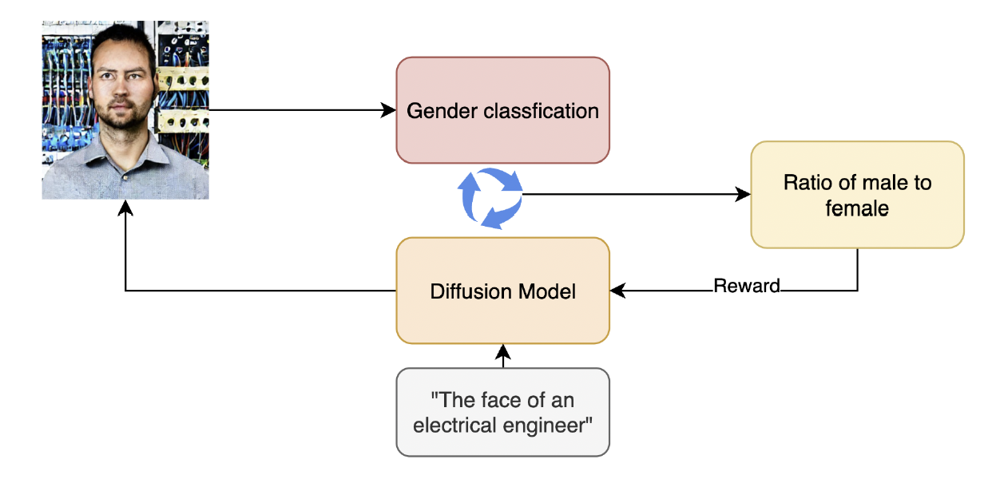

# Mitigating Gender Bias in Generative Models using RLAIF

This is an implementation of a research project called "[Diminishing Stereotype Bias in Image Generation Model using Reinforcement Learning Feedback](https://virgile-foussereau.github.io/pdf/RLAIF.pdf)". This work was done by Xin Chen and Virgile Foussereau for the course "Deep Reinforcement Learning" given by Prof. Sergey Levine at UC Berkeley in Fall 2023.

## Abstract

Addressing biases in Artificial Intelligence (AI), especially in generative models, remains paramount for responsible AI development. In this research project, we explore the potential of Reinforcement Learning from AI Feedback (RLAIF) to steer image generation models towards more unbiased outputs. We use a pretrained diffusion model and evaluate the gender unbalance through a gender classification Transformer model. We first show that RLAIF is able to shift the gender balance of diffusion model outputs without visible effect on image quality. Then we demonstrate its effectiveness in reaching gender balance within a few training steps. Finally we discuss trust regions consideration and generalization of our results. 

## Credits

This implementation is based on the [DDPO repository](https://github.com/kvablack/ddpo-pytorch).
